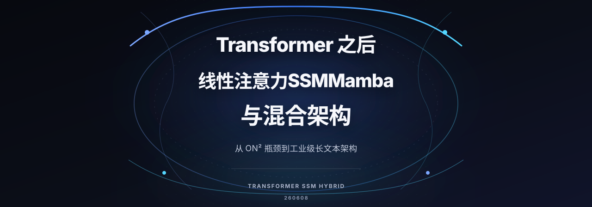

> Transformer 把序列建模推到了顶峰，也把 $O(n^2)$ 的计算代价显式化了。当上下文越拉越长、端侧/具身对延迟越来越敏感、训练成本持续走高时，Transformer 的瓶颈就成了核心矛盾。破局思路主要分为四条主线：**线性注意力（Linear Attention）**、**状态空间模型（SSM / Mamba）**、**线性 RNN（RWKV）** 以及 **混合架构（Hybrid）**。

---

## 一、Transformer 留下的两个核心瓶颈

1. **平方复杂度**：标准 Self-Attention 计算在序列长度 $n$ 上是 $O(n^2)$，长上下文（如百万级 Token）在训练和推理端都极其昂贵。此外，KV-Cache 随序列长度线性膨胀，对显存带来巨大压力。
2. **难做无限流式输入**：Transformer 依赖离散 Attention 矩阵，没有天然的“定长状态压缩 + 持续流式更新”机制，在面对长视频、长对话及机器人在线决策时不甚优雅。

后续工作的共同目标可以用一句话概括：**把序列建模做到接近线性复杂度，同时保持模型表现不出现断崖式下跌**。

---

## 二、Linear Attention（线性注意力一族）

### 核心原理
把标准 $\text{softmax}(QK^T)V$ 的二次方复杂度替换或近似成线性形式。相当于对 Attention 算子做“微创手术”，但保留 Transformer 的宏观多头与残差连接结构。

### 关键流派

1. **稀疏注意力（Sparse Attention）**：
   - 只让每个 Token 查看局部窗口、跨步跳点或少数全局哨兵 Token。
   - 代表：**Longformer**（局部滑窗 + 全局 Token）、**BigBird**（随机 + 局部 + 全局组合）。
2. **核函数化与低秩近似（Kernelization & Low-rank）**：
   - 利用核函数拆开 Softmax，改变矩阵乘法结合律：从 $(QK^T)V$ 变为 $Q(K^TV)$，直接将复杂度降至 $O(n)$。
   - 代表：**Linformer**（维度低秩投影）、**Performer**（随机正交特征 FAVOR+ 逼近）。
3. **工程精确加速（Kernel 优化）**：
   - 不改动数学公式，专注于 GPU 访存优化与重算策略。
   - 代表：**FlashAttention v1/v2/v3**（利用 SRAM 分块重算，访存压至 $O(n)$）、**PagedAttention**（vLLM 借鉴操作系统的分页虚拟内存管理 KV-Cache）。

---

## 三、SSM 与 Mamba（状态空间模型）

### 什么是 SSM？
**状态空间模型（State Space Model）** 源于经典的连续时间控制系统理论，其数学方程为：
$$h'(t) = A \cdot h(t) + B \cdot x(t)$$
$$y(t) = C \cdot h(t) + D \cdot x(t)$$

深度学习将其离散化、参数化并层层堆叠，形成了 **S4 → Mamba → Mamba-2** 的演进路线。

### 核心技术突破

- **S4（Structured State Space）**：采用结构化对角加低秩矩阵（DPLR），解决了极长序列在数学上的求解难题。
- **Mamba（选择性 SSM）**：让 $A, B, C$ 矩阵变为输入的函数——使模型学会了“根据输入动态选择记住什么、遗忘什么”，相当于将 LSTM 的门控机制引入连续状态空间。
- **硬件友好的并行扫描（Parallel Scan）**：克服传统 RNN 串行训练慢的弱点，在 GPU 上实现高吞吐并行训练。
- **Mamba-2 与状态空间对偶（SSD）**：在数学层面将 SSM 与广义线性 Attention 统一，实现比 Mamba-1 显著的吞吐提升。

### 优劣势对比
- **优势**：训练复杂度 $O(n)$，推理时维护固定尺寸的状态向量（每步 $O(1)$），天然支持流式输入。
- **局限**：在原文精确检索（如大海捞针 Passkey 检索、电话簿查找）等任务上，纯 SSM 表现略弱于全注意力。

---

## 四、RWKV（线性 RNN 的复兴）

**RWKV（Receptance Weighted Key Value）** 将 Transformer 的 Attention 改写为既能像 RNN 一样递推推理，又能像 Transformer 一样高度并行训练的优雅形式。

- **训练视角**：按时间维度展开为矩阵乘法，GPU 满载并行训练；
- **推理视角**：按时间步递推更新固定的隐状态，显存占用与上下文长度完全脱钩。
- **演进**：从 RWKV-4、RWKV-5 (Eagle)、RWKV-6 (Finch) 到融合稀疏注意力的 RWKV-X。
- **适用场景**：端侧部署、树莓派、CPU 纯推理与永不停机的流式会话。

---

## 五、混合架构（Hybrid Architecture）

由于纯 SSM 在精确召回上略显不足，而纯 Transformer 在长上下文下算力显存爆炸，**层级交错的 Hybrid 架构**成为了 2024 年以来的工业界主流方向。

核心思路是：**以大量 SSM/RNN 模块为骨干承担长程流式吞吐，穿插少量标准 Attention 层作为锚点提供高精度检索**。

| 混合模型 | 核心组合方式 | 出处 / 机构 |
| :--- | :--- | :--- |
| **Jamba** | Transformer + Mamba + MoE，每隔数层穿插一次 Attention | AI21 Labs |
| **Zamba / Zamba2** | Mamba 骨干 + 共享全局 Transformer Block | Zyphra |
| **Samba** | 层级交错 Mamba + 滑动窗口 Attention，实现 1M 上下文外推 | Microsoft |
| **RWKV-X** | RWKV 短程递推 + 稀疏 Attention 远距离依赖 | 开源社区 |

---

## 六、全景对比与技术选型

### 各代架构综合对比

| 架构流派 | 计算复杂度 | 超长上下文能力 | 精确事实召回 | 推理状态特征 | 当前工业定位 |
| :--- | :--- | :--- | :--- | :--- | :--- |
| **Transformer** | $O(n^2)$ | 显存受限 | 极强 | KV-Cache 随长度线性膨胀 | 当前绝对基准 |
| **Linear Attention** | $O(n) \sim O(n \log n)$ | 中等 | 中等 | 视具体实现而定 | 长文档 / 局部加速 |
| **SSM / Mamba** | $O(n)$ | 极强 | 中等（需配合检索） | 固定尺寸隐状态 | 超长序列新基座 |
| **RWKV** | $O(n)$ | 极强 | 中弱 | 固定尺寸隐状态 | 端侧 / 持续流式推理 |
| **Hybrid (Jamba/Samba)** | 接近 $O(n)$ | 极强 | 强 | 固定状态 + 少量局部 KV | 综合性能与成本平衡之选 |

### 选型落地建议

1. **现有成熟大模型微调与业务上线**：首选 `FlashAttention + PagedAttention + 量化`（事实上的生产标准）。
2. **百万级长文本 / 海量文档 RAG 产品**：优先考虑 `Jamba / Samba` 类的混合架构。
3. **端侧设备 / 树莓派 / 离线边缘部署**：选择 `RWKV` 或 `Mamba-2`，摆脱 KV-Cache 内存黑洞。
4. **机器人 / 具身智能在线策略控制**：状态恒定的 SSM/RWKV 结构在实时流式循环中具备显著架构优势。

