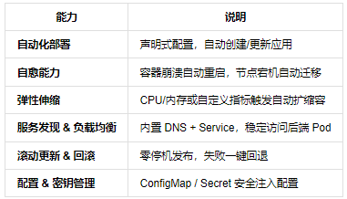
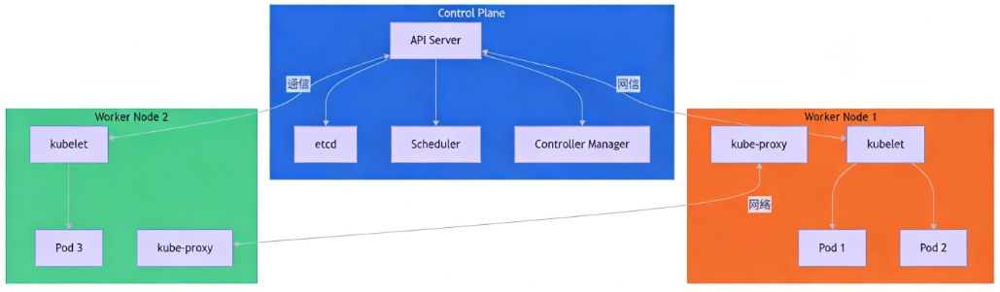
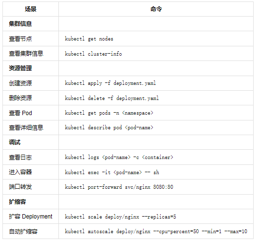
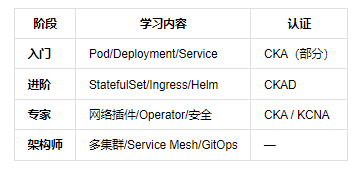

> 这篇笔记不是死记硬背 K8s 概念，而是建立一条清晰的主线：为什么需要 K8s、它由哪些组件组成、最常用的对象是什么、如何部署一个最小 Web 应用，以及排障时先看哪里。

---

## 一、是什么：从单机到集群

**Kubernetes（简称 K8s）** 是一个开源的容器编排平台。

Docker 解决的是“怎么把应用和运行环境打包起来”，而 K8s 进一步解决的是**“当成百上千个容器分布在多台服务器上时，如何进行调度、扩缩容、自愈、服务发现和统一治理”**。

```text
一句话理解：
Docker 管单个容器或单机上的一组容器；K8s 管整个集群里的容器应用生命周期。
```

K8s 的核心思想是**声明式 API + 调谐循环（Reconciliation Loop）**：
1. 用户用 YAML 文件声明期望状态（Desired State）；
2. API Server 接收并持久化声明；
3. Controller 持续比对“当前实际状态”与“期望状态”；
4. 一旦发现不一致，控制器会自动执行动作修复，直至达成一致。



---

## 二、为什么需要它：对比单机 Docker

单机 Docker 容易上手，但在面对生产环境真实流量时存在明显短板：

| 生产痛点 | 单机 Docker 的局限 | K8s 的解决思路 |
| :--- | :--- | :--- |
| **容器异常崩溃** | 依赖脚本或人工手动重启 | 自动检测并拉起新 Pod |
| **突发流量高峰** | 人工评估并手动加机器扩容 | HPA 根据 CPU/内存指标自动水平扩容 |
| **容器 IP 频繁变动** | 服务间通信硬编码容易失效 | Service 提供稳定 DNS 与虚拟 IP 负载均衡 |
| **跨多台物理机部署** | 手工规划容器部署位置 | Scheduler 依据资源策略自动调度至最佳 Node |
| **版本无缝升级** | 停机维护或容易中断连接 | Deployment 支持平滑滚动更新与一键版本回滚 |

---

## 三、核心架构设计

K8s 集群整体划分为两大组成部分：**控制平面（Control Plane）** 与 **工作节点（Worker Nodes）**。



### 1. 控制平面（大脑）

- **API Server**：集群唯一的对外暴露入口，处理所有的 `kubectl` 命令行、控制循环与外部调用。
- **etcd**：高可用的分布式一致性键值数据库，保存整个集群的所有元数据与状态。
- **Scheduler**：资源调度器，根据 Node 负载、污点亲和性等规则决定 Pod 跑在哪台机器。
- **Controller Manager**：维护整个集群的期望状态，包含节点控制器、副本控制器、端点控制器等。

### 2. 工作节点（工人）

- **kubelet**：运行在每个 Node 上的核心 Agent，负责与容器运行时通信并汇报节点与 Pod 状态。
- **kube-proxy**：维护节点上的网络转发规则（iptables / IPVS），实现 Service 流量分发。
- **Container Runtime**：底层容器运行时（如 containerd、CRI-O）。

---

## 四、核心对象与配置模式

### 1. Pod
Pod 是 K8s 的**最小调度单元**。一个 Pod 内可包含一个或多个紧密协作的容器（如主应用 + Sidecar 收集日志），它们共享同一个 Network Namespace（共用 IP 与端口空间）以及存储卷。

```yaml
apiVersion: v1
kind: Pod
metadata:
  name: nginx-pod
spec:
  containers:
    - name: nginx
      image: nginx:1.25
      ports:
        - containerPort: 80
```

### 2. Deployment
用于管理无状态应用的生命周期。通过控制底层的 ReplicaSet 确保始终维持指定数量的健康副本，并提供零停机滚动更新能力。

```yaml
apiVersion: apps/v1
kind: Deployment
metadata:
  name: nginx-deploy
spec:
  replicas: 3
  selector:
    matchLabels:
      app: nginx
  template:
    metadata:
      labels:
        app: nginx
    spec:
      containers:
        - name: nginx
          image: nginx:1.25
          ports:
            - containerPort: 80
```

### 3. Service
由于 Pod 会频繁漂移与重建，其 IP 并不固定。**Service** 通过 `selector` 标签选择器将流量稳定代理至背后的 Pod 组。

| Service 类型 | 适用场景 |
| :--- | :--- |
| **ClusterIP** | 仅集群内部互相访问（默认类型） |
| **NodePort** | 在所有节点开放特定端口（30000-32767），便于外部直接打到节点 IP |
| **LoadBalancer** | 借助云厂商（AWS/GCP/阿里云）自动申请并绑定公网负载均衡器 |
| **Ingress** | 七层 HTTP/HTTPS 路由入口，实现域名解析、URL 路径分发与 SSL 卸载 |

### 4. ConfigMap 与 Secret
坚持“配置与镜像解耦”原则：
- **ConfigMap**：存放常规环境变量、非敏感配置文件。
- **Secret**：存放密码、证书、API Token（Base64 编码，落盘可加密）。

---

## 五、kubectl 常用命令与极速排障



### 1. 常用核心指令
```bash
# 查看各类资源状态
kubectl get nodes
kubectl get pods -A -o wide
kubectl get svc,deploy

# 声明式部署与下线
kubectl apply -f app.yaml
kubectl delete -f app.yaml

# 查看详细事件与状态
kubectl describe pod <pod-name>
kubectl logs <pod-name> -f
kubectl logs <pod-name> --previous   # 查看崩溃前上一个容器的日志
kubectl exec -it <pod-name> -- sh    # 进入容器调试
```

### 2. 四大经典问题快速定位指南

1. **Pod 一直处于 `Pending` 状态**：
   - 运行 `kubectl describe pod <name>` 查看 Events。
   - 常见根因：节点 CPU/内存资源不足、节点被打上了 `Taint` 污点、PVC 存储卷未成功绑定。
2. **Pod 出现 `CrashLoopBackOff`**：
   - 优先查看日志：`kubectl logs <name> --previous`。
   - 常见根因：主进程退出代码非 0、缺少必须的环境变量、配置文件挂载损坏、健康检查探针过于严苛。
3. **Service 访问不通**：
   - 查看是否关联到了 Endpoints：`kubectl get endpoints <svc-name>`。
   - 常见根因：Service 的 `selector` 标签与 Pod 的 `labels` 拼写不一致，或者容器内部监听的端口与 `targetPort` 不匹配。
4. **频繁出现 `OOMKilled` 重启**：
   - 检查 Pod 的内存资源限制 `resources.limits.memory` 是否设置过小，适当调高配额。

---

## 六、推荐学习路线图



1. **基础准备**：熟练掌握 Dockerfile 编写、镜像分层瘦身、容器网络与挂载卷。
2. **本地上手**：使用 Minikube 或 Kind 本地拉起单/多节点测试集群。
3. **掌握核心资源**：熟练编写 Pod、Deployment、Service、ConfigMap/Secret、PV/PVC 模板。
4. **网络与入口**：掌握 Ingress-Nginx 规则配置与 Helm 常用包管理。
5. **生产进阶**：搭建 Prometheus + Grafana 监控体系、设置 HPA 水平扩缩容、配置 RBAC 权限与资源 Limits。

---

## 参考资料
- 官方中文文档：[kubernetes.io/zh-cn/docs/](https://kubernetes.io/zh-cn/docs/home/)
- 官方示例仓库：[github.com/kubernetes/examples](https://github.com/kubernetes/examples)

