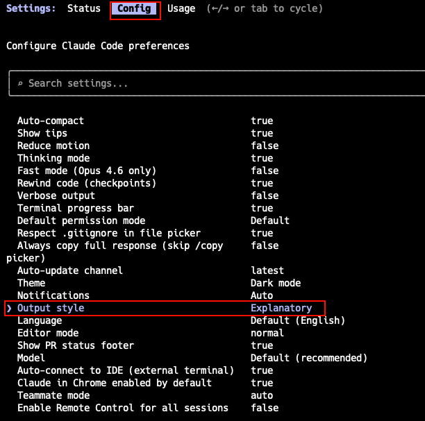
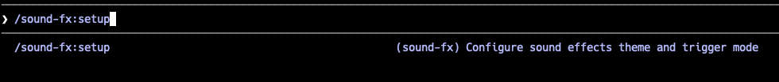

> 安装好 Claude Code 之后，默认配置虽然能跑，但有很多体验和效率上的痛点——比如回答过于精简、没有实时状态栏、每次新会话都要重新交代偏好等。本文整理了 9 项开箱必做的核心设置，助你打造极致顺手的主力 AI 编程环境。

---

## 第一部分：交互体验——调好界面再干活

### 1. 输出风格 Output Style

**问题**：默认的 Default 风格极度精简——改完代码只告诉你 "done"，不解释为什么这样改、用了什么模式。对于熟悉新项目或理解复杂改动，这种风格信息量明显不足。

**操作**：运行 `/config` → 选择 Output style → 切换为 **Explanatory**。



切换后，Claude 的回复会附带 **Insights** 段落，解释它的实现选择和识别到的代码库模式。这不是公开推理链（那是 Extended Thinking），而是面向开发者的决策说明。

**三种内置风格对比**：

| 风格 | 行为 | 适合谁 |
| :--- | :--- | :--- |
| **Default** | 精简回复，专注完成任务 | 熟悉项目、只想要结果的老手 |
| **Explanatory** | 附带 Insights，解释实现选择 | 日常开发，熟悉新代码库 |
| **Learning** | 协作学做，标记 `TODO(human)` 让你写关键代码 | 学习新语言或新手入门 |

**自定义风格**：如果内置风格都不满足，可以创建自己的。在 `~/.claude/output-styles/` 下放一个 Markdown 文件：

```markdown
---
name: My Style
description: 简短描述
keep-coding-instructions: true
---

# 你的风格指令
定义 Claude 在这个风格下的行为...
```

也可以用 `/output-style:new` 让 Claude 帮你生成。

> **注意**：输出风格在会话开始时写入系统提示词，之后会被缓存以提升响应速度。因此切换风格后需要**开新会话**才能生效。

---

### 2. 状态栏 Status Line

**问题**：默认界面没有任何状态信息——不知道当前用的是 Opus 还是 Sonnet，不知道 token 消耗了多少，不知道上下文窗口还剩多少空间。

**操作**：安装 CCometixLine，一个 Rust 编写的高性能状态栏工具。

```bash
npm install -g @cometix/ccline
```

然后在 `~/.claude/settings.json` 中添加配置：

```json
{
  "statusLine": {
    "type": "command",
    "command": "ccline",
    "padding": 0
  }
}
```


安装后，终端底部会出现一行状态栏，实时显示四个关键信息段：
- **Model**：当前模型名称（如 `Opus 4.6`、`Sonnet 4.6`）
- **Directory**：当前工作目录
- **Git**：分支名 + 状态（`✓` 干净 / `●` 有改动 / `↑n` 领先远程 n 个提交）
- **Context Window**：基于 transcript 分析的 token 使用百分比

**TUI 配置**：运行 `ccline --config` 进入交互式配置界面，可以实时预览效果、切换主题（内置 `cometix`、`minimal`、`gruvbox`、`nord` 等预设）、逐段自定义颜色和图标。配置文件保存在 `~/.claude/ccline/config.toml`。

> **依赖**：需要安装 Nerd Font 字体，否则图标会显示为乱码方块。

---

### 3. 声音提示 Sound Effects

**问题**：Claude Code 执行长任务可能需要数分钟。切到浏览器或后台后，不知道何时跑完，也不清楚中间是否报错。

**操作**：安装 claude-sound-fx 插件。

```bash
/plugin marketplace add 6m1w/claude-sound-fx
/plugin install sound-fx@claude-sound-fx
/sound-fx:setup
```



**音效特色**：
- **12 个主题音效包**：覆盖科幻/AI（Jarvis、GLaDOS、Star Trek）、动漫（JoJo、One Piece、Pikachu）、游戏（WoW Peon、SCV、机械键盘音）。
- **7 个触发事件**：Session 开始、提交 Prompt、任务完成、工具调用失败、收到通知、Memory 压缩、Session 结束。
- **两种模式**：Mix（随机抽取）与 Single Theme（固定单一主题）。

音量可通过环境变量 `CLAUDE_SOUND_VOLUME` 调整（0-100，默认 60）。

---

## 第二部分：记忆与规则——让 AI 记住你的偏好

### 4. 记忆系统：CLAUDE.md 与 Auto Memory

**问题**：每次开新会话，Claude Code 都从零开始。你得重新交代“用中文回复”、“测试用 pytest 不要 unittest”、“提交信息用中文”等。

**核心操作**：编辑 `~/.claude/CLAUDE.md`，写入你的全局偏好。

```markdown
# 全局指令

## 语言
- 默认使用中文回复

## 代码风格
- Python 使用 type hints
- 变量命名 snake_case
- 提交信息用中文

## 工具偏好
- 测试框架用 pytest
- 包管理用 uv 不用 pip
```

**关键区分——全局 vs 项目**：

| 位置 | 写什么 | 共享范围 |
| :--- | :--- | :--- |
| `~/.claude/CLAUDE.md` | 个人偏好（语言、风格、工具） | 仅自己，跨所有项目 |
| `./CLAUDE.md` 或 `./.claude/CLAUDE.md` | 项目规范（构建命令、架构决策、命名规范） | 通过 Git 共享给团队 |

**编写技巧**：
- **控制在 200 行以内**：避免过多占用上下文并保证高遵从度。
- **用要点式（Bullet Points）**：实测指令遵循度远高于大段长文本。
- **写可验证的具体指令**：“使用 2 空格缩进”比“格式化代码”更精准。

**Auto Memory**：除了手写的 CLAUDE.md，Claude 也会把有价值的信息（构建命令、调试经验、架构笔记）自动沉淀到 `~/.claude/projects/<project>/memory/` 下。一句话总结：**你写 CLAUDE.md，Claude 写 MEMORY.md**。

---

## 第三部分：终端环境与协作

### 5. 终端基础配置

在 Claude Code 中运行 `/terminal-setup`，它会自动配置终端环境：
- **换行体验**：`Shift+Enter` 是 Claude Code 的换行快捷键。VS Code 集成终端、Alacritty、Warp 运行设置后即可顺畅多行输入。
- **桌面通知**：长任务跑完后自动弹窗提示。
- **大段输入技巧**：避免直接向终端粘贴数千行代码，推荐保存为文件后让 Claude 自行读取。

---

### 6. 推荐终端：Warp

如果你愿意尝试新终端，Warp 是目前对 Claude Code 支持最出色的终端之一：
- **Command Blocks**：把命令输入/输出封装为独立折叠块，防止海量日志淹没终端。
- **官方集成插件**：
  ```bash
  /plugin marketplace add warpdotdev/claude-code-warp
  /plugin install warp@claude-code-warp
  ```

---

## 第四部分：能力增强——解锁进阶特性

### 7. Agent Team 多代理协作

**问题**：默认情况下 Claude Code 是单线程工作。写前端时后端只能等待，跑测试时无法同步整理文档。

**操作**：在 `~/.claude/settings.json` 的 `env` 字段中开启：

```json
{
  "env": {
    "CLAUDE_CODE_EXPERIMENTAL_AGENT_TEAMS": "1"
  }
}
```

开启后，Claude Code 可以协调多个实例协同工作。一个会话作为 **Team Lead** 负责拆解和汇总，多个 **Teammate** 分头执行并支持队友间直接通信。

> **注意代价**：Token 消耗量与队员数成正比，建议在大规模并行重构或多模块并发任务时开启。

---

### 8. 后台模型升级

Claude Code 的内部后台功能（如上下文总结、任务分类）默认使用 Haiku。如果希望工具调用更加精准、多步规划更稳健，可以将后台默认模型升级为 Sonnet：

```json
{
  "env": {
    "ANTHROPIC_DEFAULT_HAIKU_MODEL": "claude-sonnet-4-6"
  }
}
```

**对比维度**：
- **参数生成质量**：Sonnet 对文件路径与搜索关键词的处理显著更准确。
- **多步规划与错误恢复**：推理链更可靠，善于主动分析原因并调整策略。

---

### 9. 安装关键 Skills

Skill 是把你反复执行的标准工作流封装成的可复用指令集。推荐安装官方与社区核心管理工具：

```bash
# 安装 skill-creator（制作自定义 skill）与 find-skills（探索社区生态）
npx skills add anthropics/skills
npx skills add vercel-labs/agent-skills --skill find-skills
```

常用命令：
```bash
npx skills list              # 列出已安装 skill
npx skills find typescript   # 按关键词搜索
npx skills update            # 一键更新
```

> **安全提示**：公共 Skill 会以宿主同等权限执行，安装第三方 Skill 时建议优先选择 1000+ 级安装量的成熟项目。

---

## 总结：9 项设置优先级速查

| 优先级 | 设置项 | 核心价值 |
| :--- | :--- | :--- |
| **必做** | Output Style → Explanatory | 回复由干瘪的“done”变为附带决策解释与架构洞察 |
| **必做** | CLAUDE.md 全局指令 | 告别开局反复交代语言与代码风格 |
| **必做** | 终端配置 `/terminal-setup` | 解决换行与长任务桌面通知 |
| **推荐** | Status Line (ccline) | 实时监控模型、Git 状态与 Token 消耗水位 |
| **推荐** | Sound Effects 音效包 | 任务完成或出错自动语音提醒，释放盯盘精力 |
| **推荐** | Agent Team 多代理 | 多模块任务并发加速 |
| **推荐** | 后台模型升 Sonnet | 显著提升复杂工具调用与多步规划的成功率 |
| **推荐** | Skills 扩展 | 将私有流程与规范沉淀为一键命令 |
| **进阶** | YOLO + Hook 安全兜底 | 高手极致提速，依靠 PreToolUse 拦截危险命令 |

