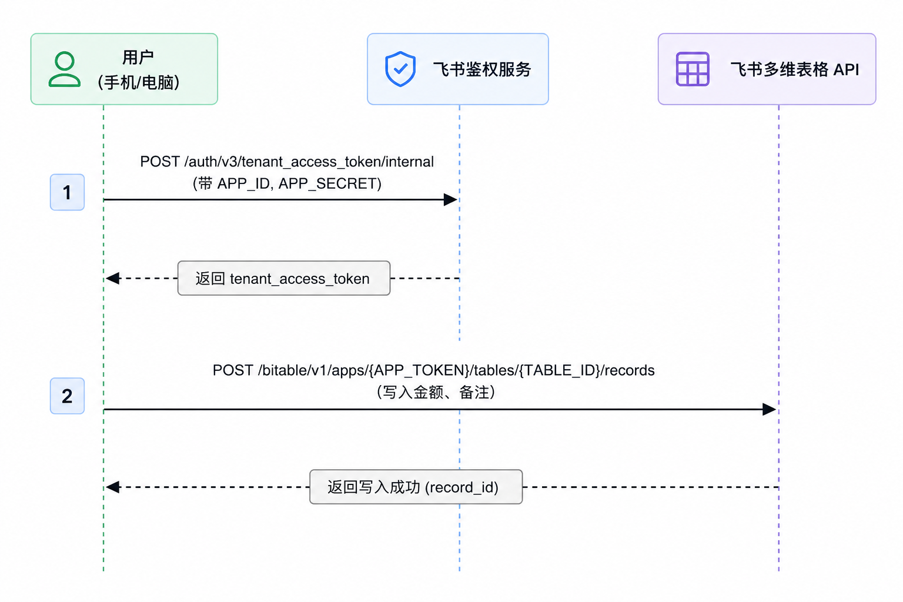
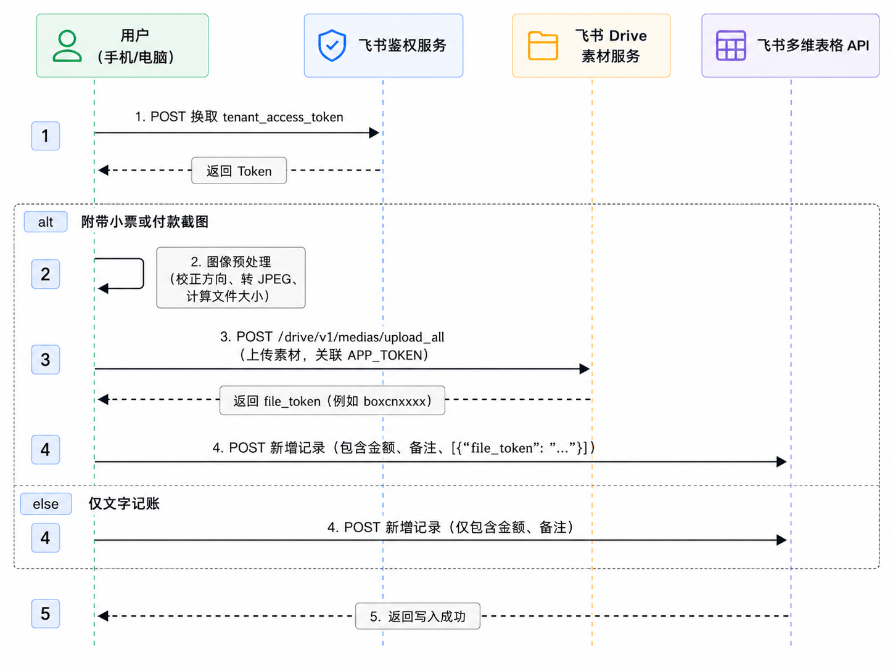

> 在电脑上输入一条 Python 命令，或者在 iPhone 上运行一个快捷指令，就能把金额、备注以及可选的付款截图写入飞书多维表格。

每次打开记账 App、选择分类、填写金额，步骤看起来不多，却很容易让人产生“稍后再记”的念头。于是我做了一套更直接的方案，让记账这件事尽量接近随手完成。

这篇文章会从实际可用的普通版出发，讲清楚如何升级到支持图片凭证的高阶版，并拆解背后的 HTTP 请求。即使不运行 Python，也可以按照同样的接口流程，在 iOS 快捷指令中零代码复刻。

本文适合：

- 想用飞书多维表格管理个人收支的人；
- 已经完成文字记账，准备增加小票或付款截图的人；
- 想理解飞书应用鉴权、素材上传和新增记录流程的人。

> **发布前安全说明：**本文中的应用凭据和资源 ID 均为占位符。请勿把自己的 `APP_SECRET` 发布到博客、代码仓库或公开分享的快捷指令中。如果密钥曾经公开，应立即在飞书开放平台重置。

---

## 目录

1. [核心架构与运行原理](#一核心架构与运行原理)
2. [前置准备：参数与权限清单](#二前置准备参数与权限清单)
3. [底层 HTTP API 接口手册（复刻核心）](#三底层-http-api-接口手册复刻核心)
4. [手机端 DIY 复刻：iOS 快捷指令实操步骤](#四手机端-diy-复刻ios-快捷指令实操步骤)
5. [电脑端 Python 脚本运行与代码解析](#五电脑端-python-脚本运行与代码解析)
6. [常见错误排查速查表](#六常见错误排查速查表)
7. [结语：先让最短链路稳定运行](#七结语先让最短链路稳定运行)

---

## 一、核心架构与运行原理

### 1.1 Python SDK vs 手机快捷指令

- **Python SDK（封装视角）**：通过 `lark-oapi` 库，只需填入 `APP_ID` 和 `APP_SECRET`，SDK 在底层自动完成鉴权换 Token、缓存与请求头装配。
- **手机端/原生 HTTP（底层视角）**：没有 SDK 支持，必须由快捷指令手动按顺序发起 **2 步（文字版）** 或 **3 步（图片版）** 标准 HTTP 请求。

### 1.2 数据流向图解

#### 版本一：极速文字记账



#### 版本二：图文结合记账（附带小票/截图凭证）




---

## 二、前置准备：参数与权限清单

### 2.1 必备的 4 个核心标识符

在开发或配置时，准备好以下 4 项参数：

| 参数名称 | 示例值 | 说明与获取途径 |
| :--- | :--- | :--- |
| **`APP_ID`** | `cli_xxxxxxxxxxxxxxxx` | 飞书开放平台 → 开发者后台 → 自建应用 → **凭证与基础信息** |
| **`APP_SECRET`** | `your_app_secret` | 同上（**重要**：请妥善保管，勿泄露） |
| **`APP_TOKEN`** | `bascnxxxxxxxxxxxxxxx` | 多维表格浏览器地址栏中 `/base/` 后面的字符串 |
| **`TABLE_ID`** | `tblxxxxxxxxxxxxxxx` | 多维表格浏览器地址栏中 `?table=` 后面的字符串 |

### 2.2 两层权限（缺一不可）

1. **应用 API 权限（开发者后台）**：
   - 申请 `查看、评论、编辑和管理多维表格` (`bitable:app`)
   - 申请 `查看、评论、编辑和管理云空间中所有文件` (`drive:drive`)
   - **关键**：勾选后必须进入「**版本管理与发布**」创建并**发布新版本**，权限才会生效。
2. **多维表格文档协作者权限（多维表格前端）**：
   - 打开目标多维表格，点击右上角「**...**」→「**添加文档应用**」；
   - 搜索并选择刚才创建的自建应用，赋予**编辑权限**。

### 2.3 多维表格字段配置

在多维表格中建好以下字段（名称需与脚本/快捷指令完全一致）：

| 字段名称 | 字段类型 | 必需版本 | 说明 |
| :--- | :--- | :--- | :--- |
| **`货币`** | 货币 或 数字 | 普通版 / 图片版 | 保存金额（支出默认记为负数） |
| **`备注`** | 单行文本 或 多行文本 | 普通版 / 图片版 | 保存消费说明 |
| **`图片`** | 附件 | 图片版必需 | 保存小票或支付截图 |

---

## 三、底层 HTTP API 接口手册（复刻核心）

### 接口 1：获取租户访问凭证 (tenant_access_token)

- **请求方式**：`POST`
- **请求 URL**：`https://open.feishu.cn/open-apis/auth/v3/tenant_access_token/internal`
- **请求头 (Headers)**：
  ```http
  Content-Type: application/json; charset=utf-8
  ```
- **请求体 (Body - JSON)**：
  ```json
  {
    "app_id": "你的_APP_ID",
    "app_secret": "你的_APP_SECRET"
  }
  ```
- **返回示例**：
  ```json
  {
    "code": 0,
    "msg": "ok",
    "tenant_access_token": "t-g1049b1xxxxxxxxxxxx",
    "expire": 7140
  }
  ```
- **解析字段**：提取 `tenant_access_token`（有效期 2 小时）。

---

### 接口 2：上传图片素材 (upload_all)

- **请求方式**：`POST`
- **请求 URL**：`https://open.feishu.cn/open-apis/drive/v1/medias/upload_all`
- **请求头 (Headers)**：
  ```http
  Authorization: Bearer <获取到的_tenant_access_token>
  ```
- **请求体格式**：`multipart/form-data`（表单提交）
- **表单字段 (Form Data)**：

| 字段名 | 类型 | 必填 | 示例值 | 说明 |
| :--- | :--- | :--- | :--- | :--- |
| `file_name` | Text | 是 | `2026-08-22.jpg` | 上传后的图片名称 |
| `parent_type` | Text | 是 | `bitable_image` | **固定值**：多维表格图片素材 |
| `parent_node` | Text | 是 | `bascnxxxxxxxxxxxxxxx` | 多维表格的 **`APP_TOKEN`** |
| `size` | Number | 是 | `102400` | 图片文件的实际字节大小 (Bytes) |
| `file` | File | 是 | *[二进制图片流]* | 图片文件数据 |

- **返回示例**：
  ```json
  {
    "code": 0,
    "msg": "success",
    "data": {
      "file_token": "boxcnABC123XYZ456"
    }
  }
  ```
- **解析字段**：提取 `data.file_token`。

---

### 接口 3：多维表格新增记录 (records/create)

- **请求方式**：`POST`
- **请求 URL**：`https://open.feishu.cn/open-apis/bitable/v1/apps/{APP_TOKEN}/tables/{TABLE_ID}/records`
- **请求头 (Headers)**：
  ```http
  Authorization: Bearer <获取到的_tenant_access_token>
  Content-Type: application/json; charset=utf-8
  ```
- **请求体 (Body - JSON)**：

  **情况 A：纯文字记账**
  ```json
  {
    "fields": {
      "货币": -43.98,
      "备注": "盖饭"
    }
  }
  ```

  **情况 B：带图片凭证记账**（注意：图片字段是包含对象的数组）
  ```json
  {
    "fields": {
      "货币": -43.98,
      "备注": "盖饭",
      "图片": [
        {
          "file_token": "boxcnABC123XYZ456"
        }
      ]
    }
  }
  ```

- **返回示例**：
  ```json
  {
    "code": 0,
    "msg": "success",
    "data": {
      "record": {
        "record_id": "recuz789xxxx"
      }
    }
  }
  ```

---

## 四、手机端 DIY 复刻：iOS 快捷指令实操步骤

在 iPhone 上打开「快捷指令」App，新建一个快捷指令。

### 4.1 复刻版本一：极速文字记账

#### 动作搭建步骤：

1. **输入金额**：
   - 动作：`要求输入` → 提示 `金额` → 输入类型选 `数字` → 设为变量 `原始金额`。
2. **金额转负数**（支出记负）：
   - 动作：`计算` → `原始金额` `×` `-1` → 设为变量 `最终金额`。
3. **输入备注**：
   - 动作：`要求输入` → 提示 `备注（如：午饭 盖饭）` → 类型选 `文本` → 设为变量 `备注`。
4. **获取 Token（接口 1）**：
   - 动作：`获取 URL 内容`：
     - URL: `https://open.feishu.cn/open-apis/auth/v3/tenant_access_token/internal`
     - 方法: `POST`
     - 标头: `Content-Type`: `application/json; charset=utf-8`
     - 请求体: `JSON`
       - `app_id` (文本) = `你的 APP_ID`
       - `app_secret` (文本) = `你的 APP_SECRET`
   - 动作：`从字典中获取值` → 获取 `tenant_access_token` → 设为变量 `Token`。
5. **写入多维表格（接口 3）**：
   - 动作：`获取 URL 内容`：
     - URL: `https://open.feishu.cn/open-apis/bitable/v1/apps/你的APP_TOKEN/tables/你的TABLE_ID/records`
     - 方法: `POST`
     - 标头:
       - `Authorization`: `Bearer ` 紧随变量 `Token`（注意中间空格）
       - `Content-Type`: `application/json; charset=utf-8`
     - 请求体: `JSON`
       - 键 `fields` (字典):
         - `货币` (数字) = `最终金额`
         - `备注` (文本) = `备注`
6. **成功反馈**：
   - 动作：`从字典中获取值` → 获取 `code`。
   - 动作：`如果` `code` `等于` `0` → `显示通知`（记账成功：[最终金额] / [备注]）+ `触感反馈`；`否则` 提示错误。

---

### 4.2 复刻版本二：图文结合记账（带小票/截图）

#### 动作搭建步骤：

```text
[开始]
  │
  ├─> 1. 判断是否有图片输入（快捷指令输入 / 相册选择 / 拍照）
  │      ├─ 有图片：设为变量 [原始图片]
  │      └─ 无图片：变量 [原始图片] 为空
  │
  ├─> 2. 要求输入 [金额] (转负数) 和 [备注]
  │
  ├─> 3. 调用接口 1 获取 tenant_access_token ──> 得到变量 [Token]
  │
  ├─> 4. 如果 [原始图片] 有值：
  │      ├─ a. 动作 [转换图像]：将图片转为 JPEG 格式（压缩质量 75%）
  │      ├─ b. 动作 [获取文件详细信息]：获取图片 "文件大小"（字节数）
  │      ├─ c. 动作 [获取当前日期]：格式化为 yyyy-MM-dd.jpg
  │      ├─ d. 动作 [获取 URL 内容]（调用接口 2 upload_all）：
  │      │       URL: https://open.feishu.cn/open-apis/drive/v1/medias/upload_all
  │      │       标头: Authorization: Bearer [Token]
  │      │       请求体: 表单 (Form)
  │      │         - file_name = [日期文件名]
  │      │         - parent_type = bitable_image
  │      │         - parent_node = [你的 APP_TOKEN]
  │      │         - size = [文件大小]
  │      │         - file = [处理后的图片]
  │      ├─ e. 提取返回中的 $.data.file_token ──> 得到变量 [file_token]
  │      └─ f. 用文本拼接带附件的 JSON（见 4.3 节技巧）
  │
  ├─> 5. 否则（无图）：
  │      └─ 用文本拼接纯文字 JSON
  │
  ├─> 6. 调用接口 3 写入记录
  │
  └─> 7. 弹出通知与震动提示完成
```

---

### 4.3 快捷指令进阶技巧：用「文本」模板拼接 JSON

在 iOS 快捷指令中手动配置多层嵌套 JSON 容易出错。**推荐做法**：使用一个「**文本**」动作写好模板，把变量直接插入其中，再把文本传给请求体：

**带图 JSON 文本模板：**
```json
{
  "fields": {
    "货币": 最终金额,
    "备注": "备注",
    "图片": [
      {
        "file_token": "file_token"
      }
    ]
  }
}
```
*(在快捷指令编辑器中，将 `最终金额`、`备注`、`file_token` 替换为对应的魔术变量。在「获取 URL 内容」中，请求体选择「文件」，并将该文本作为输入即可)*

---

## 五、电脑端 Python 脚本运行与代码解析

### 5.1 环境安装

```powershell
python -m pip install lark-oapi Pillow
```

### 5.2 脚本配置

打开 `记账.py` 或 `记账-图片版.py`，填写配置区域：

```python
APP_ID = "cli_xxxxxxxxxxxxxxxx"
APP_SECRET = "your_app_secret"

APP_TOKEN = "bascnxxxxxxxxxxxxxxx"
TABLE_ID = "tblxxxxxxxxxxxxxxx"

AMOUNT_FIELD = "货币"
REMARK_FIELD = "备注"
IMAGE_FIELD = "图片"      # 图片版专用
EXPENSE_AS_NEGATIVE = True # 支出强制记负数
```

### 5.3 运行命令

```powershell
# 普通文字版
python 记账.py 43.98 盖饭

# 图片版（不带图）
python 记账-图片版.py 43.98 盖饭

# 图片版（带同目录图片）
python 记账-图片版.py 43.98 盖饭 1.png

# 图片版（带绝对路径图片）
python 记账-图片版.py 43.98 盖饭 "D:\账单\1.png"
```

### 5.4 图片版的关键优化

1. **自动纠正方向**：通过 `ImageOps.exif_transpose()` 读取手机拍摄的 EXIF 方向，避免小票倒置。
2. **透明图层铺白底**：将带有透明通道的 PNG/WebP 转为纯白背景 RGB。
3. **内存无损压缩**：在 `BytesIO` 内存流中直接压缩为 JPEG（Quality 75），不产生本地临时垃圾文件。
4. **智能参数解析**：脚本自动检测最后一个参数是否为有效图片路径；若是则上传图片，其余参数合并为备注。

---

## 六、常见错误排查速查表

| 返回码 (code) / 报错 | 根本原因 | 解决方案 |
| :--- | :--- | :--- |
| **`99991663` / `99991664`** | `APP_ID` 或 `APP_SECRET` 错误 | 检查飞书开发者后台「凭证与基础信息」，确保无前后空格。 |
| **`91403` / `403 Forbidden`** | 1. 未开通并发布权限<br>2. **未将应用加入文档** | 1. 开放平台申请权限并**发布版本**；<br>2. **在多维表格右上角「...」→「添加文档应用」添加该自建应用（编辑权限）**。 |
| **`1254005`** | `APP_TOKEN` 错误 | 确认复制的是 URL 中 `/base/` 后面的整串 ID，不是知识库 token 或视图 ID。 |
| **`1254302`** | `TABLE_ID` 错误 | 确认复制的是当前记账数据表的 `table_id`（以 `tbl` 开头）。 |
| **`1254040` / `1254043`** | 字段不存在 / 类型不匹配 | 检查表格表头是否确为「货币」「备注」「图片」；「货币」字段必须是数字/货币类型，「图片」必须是附件类型。 |
| **`400 Bad Request` (上传图片)** | 参数格式不符合要求 | 检查 `parent_type` 是否固定为 `bitable_image`；`parent_node` 是否为 `APP_TOKEN`；`size` 需为图片字节大小。 |
| **`401 Unauthorized`** | Token 无效或未携带 | 请求头必须包含 `Authorization: Bearer <Token>`（注意 `Bearer` 和 Token 之间有一个空格）。 |

---

## 七、结语：先让最短链路稳定运行

这套自动记账系统的关键不在于功能堆得有多满，而在于把一次记账压缩成足够自然的动作：输入金额和备注，必要时再附上一张凭证。

建议按照下面的顺序逐步验证：

```text
普通版成功写入金额与备注
        ↓
图片版在不带图时正常写入
        ↓
成功上传一张 JPG 或 PNG
        ↓
金额、备注和图片出现在同一条记录中
```

当这条链路稳定后，还可以继续增加消费分类、支付方式、自动日期、月度统计和预算提醒。每次只增加一个变量，出了问题会更容易定位，也不会破坏已经好用的基础版本。

### 参考资料

- [飞书开放平台：新增多维表格记录](https://open.feishu.cn/document/server-docs/docs/bitable-v1/app-table-record/create?lang=zh-CN)
- [飞书开放平台：上传素材](https://open.feishu.cn/document/server-docs/docs/drive-v1/media/upload_all)
- [飞书开放平台：获取 tenant_access_token](https://open.feishu.cn/document/server-docs/authentication-management/access-token/tenant_access_token_internal)
- [飞书开放平台：申请 API 权限](https://open.feishu.cn/document/server-docs/application-scope/introduction?lang=zh-CN)
