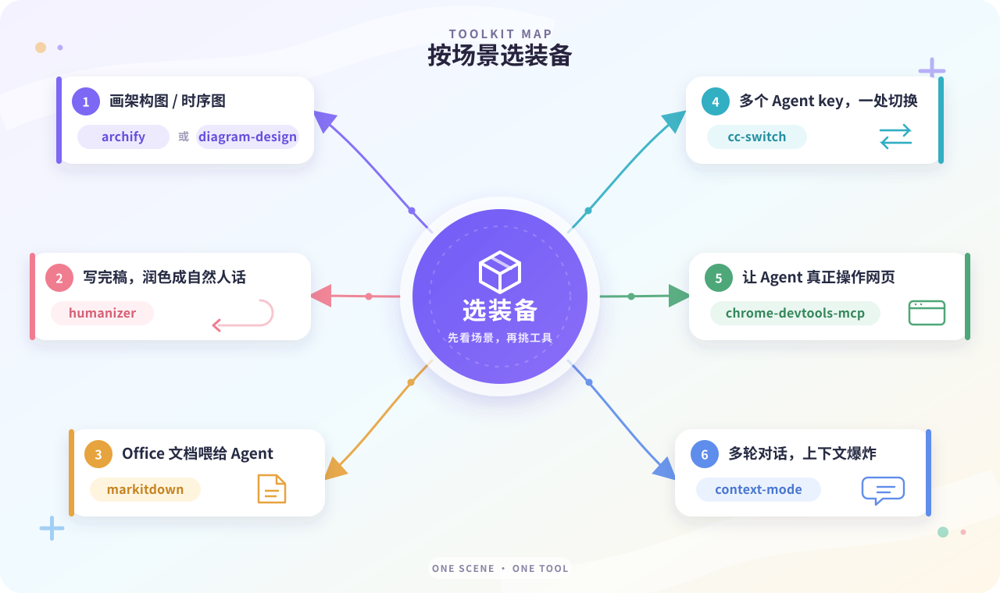

最近 GitHub 上 Agent 生态这块，真的火得有点离谱。

我把自己 Stars 里攒的三类东西——**Skills（技能）**、**Plugins（插件）**、**Tools（工具+提示词）**——翻了个底朝天，挑出 16 个真正能用上手的，给你挨个说。

数据都是 2026 年 9 月 16 号现拉的，Star 数和描述全是 GitHub API 原文，不是我编的。

---

## 技能篇：教 Agent「怎么做」

技能这东西，本质就是一份写给 AI 的 SOP——你告诉它"遇到这种情况按这套流程走"，它就按你的意思来了。

<strong>1. <a href="https://github.com/tt-a1i/archify">tt-a1i/archify</a></strong> ⭐ 63.9k

让 Agent 画架构图，archify 排第一：架构、工作流、时序、数据流、生命周期，五种图一个仓库全包。

不是 Mermaid 那种"先写 DSL 再渲染"的路线——直接生成自包含 HTML，带动效，浏览器打开就能看，想丢进文档就一键导出清晰 PNG。

仓库描述里的 "verifiable"（可验证）不是白说的：图的结构对应真实代码，不是拍脑袋画框。技术文章里讲项目、评审里画系统结构，用它。

<strong>2. <a href="https://github.com/blader/humanizer">blader/humanizer</a></strong> ⭐ 48.8k

专门去"AI 味"的：GPT 写的稿子动不动"在当今快节奏的数字时代……"、"赋能"、"值得注意的是"，这些套话它挨个识别出来，按你原文的意思重写成人话。

仓库原话是 "removes signs of AI-generated writing from text"——不是润色，是做"去 AI 特征"。事实、数据、结论一个不动，动的只是那些一眼就能闻出来的机器腔。

写公众号、写博客、写对外材料，成稿后拿它过一遍，读者体验完全两回事。我的固定流程就是它压轴。

<strong>3. <a href="https://github.com/cathrynlavery/diagram-design">cathrynlavery/diagram-design</a></strong> ⭐ 40.3k

和上面 archify 路线不一样：diagram-design 走"编辑级排版"——38 种图表类型，全部自包含 HTML + SVG，不带阴影、不讲"Mermaid slop"（作者原话就是冲着烂烂的 Mermaid 图去的）。

Claude Code、Codex、Pi 三端通用。静态 SVG 意味着它天生适合打印和正式文档：文章配图、幻灯片、给老板看的 PPT，这种要"正经"的场合它比动效系稳。

一句话：想花哨用 archify，想体面用 diagram-design，两个我一起装。

<strong>4. <a href="https://github.com/zhaoxuya520/reverse-skill">zhaoxuya520/reverse-skill</a></strong> ⭐ 36.1k

安全方向的路由包，仓库描述自己就写得很清楚：Reverse Engineering / Authorized Penetration Testing / Security Research。

它解决的是"Agent 做安全任务时瞎猜命令"的毛病——自动识别你这次是 APK 逆向、二进制分析、CTF 还是渗透，然后按需自举对应工具链，不让你一条一条敲。

内置经验库持续进化，支持 Claude Code、Kiro、Cursor、Cline 等客户端。丑话说前头：只做授权目标，别拿它去碰没授权的东西，那叫违法。

<strong>5. <a href="https://github.com/Fokkyp/SoftwareCopyright-Skill">Fokkyp/SoftwareCopyright-Skill</a></strong> ⭐ 5.4k

国内开发者懂的都懂：软著登记，材料一套做下来半天起步。这个仓库做的事就是替你干这件事：读一遍你本地的项目代码，直接生成全套 .docx 软著申请材料，全开源，不用再花钱买代做服务。

之前这类"一键软著"基本都要付费，它是直接把这个流程做成了 Skill 免费放出。

适合手里有项目、要走软著登记的独立开发者和团队。丑话说前头：生成的是申请材料的初稿，内容真实性和法律责任还是你自己的事，交之前自己过一遍。

<strong>6. <a href="https://github.com/jakubkrehel/skills">jakubkrehel/skills</a></strong> ⭐ 6.8k

Jakub Krehel 这套技能，专门教 AI "把网页做得更好看、更好用"（仓库描述原话：help you build great interfaces）。

具体能干的事很实在：整理页面结构和间距、调字体和配色让层次清楚、把"内容为空、文字太长"这种容易出乱子的边界情况提前检查掉。

最加分的是它能为同一个按钮、同一张卡片出好几个版本给你挑——做前端界面时，"方案 A/B/C 摆一起对比"这个能力，比单次生成快得多。

<strong>7. <a href="https://github.com/humanlayer/skills">humanlayer/skills</a></strong> ⭐ 4.2k

HumanLayer 团队（做 Claude Code 工程化的那拨人）把内部沉淀的工程实践开源成了一组 Skill，每个 Skill 都是为了解决一个具体问题，不是大而全的框架。

拿两个具体的说：improve-claude-md 重写项目的 CLAUDE.md，用条件化指令块组织规则，让 AI 在对应场景下按你的规矩来；narrow-react-prop-types 根据 React 组件的真实用法收紧 props 类型，把"只为了过测试"的宽泛类型干掉。

还有 build-iterated-agentic-loop（给编程 AI 搭 GitHub Actions 迭代循环）、design-control-loop（把"观察→决策→执行→检查"的自动化循环跑起来）、show-me（用图示和 HTML 页面把当前话题讲明白）。

整套思路是：Skill 不是玩具，是把团队里"老手才知道怎么做"的东西写成 Agent 能执行的标准动作。已经在用 Claude Code、想把项目规则和开发流程管起来的团队，值得一翻。

<strong>8. <a href="https://github.com/adrianpunk/Punk-Skill">adrianpunk/Punk-Skill</a></strong> ⭐ 1.0k

我自己的私藏，也是这个博客里所有文章封面、架构图的"幕后功臣"。三个 Skill：

punk-cover 管博客封面，30 多种画风随便挑，标题一给它就出图；punk-avatar 出头像；diagram-drawer 画结构图。

之所以单列出来，是因为它代表了一类东西——不是通用能力，是"某个人反复打磨、形成肌肉记忆"的工作流被固化成 Skill。你自己反复做的事，都可以这么沉淀。

---

## 插件篇：给 Agent「加工具」

技能是教方法，插件是给能力——说白了就是 MCP（Model Context Protocol）那一套，让 Agent 直接操作外部世界。

<strong>1. <a href="https://github.com/ChromeDevTools/chrome-devtools-mcp">ChromeDevTools/chrome-devtools-mcp</a></strong> ⭐ 52k

Chrome 团队亲儿子，"Chrome DevTools for coding agents"——让 AI 能自己打开 Chrome、操作网页，并且能查出问题在哪。

接上之后能干四件事：① 操作网站（点按钮、填表单、验证流程）；② 查"点了没反应、图片不加载"背后的真实报错；③ 分析页面为什么慢、哪个环节拖后腿；④ 截图核对实际渲染效果。

"Agent 要碰真浏览器"这件事，官方出品的 MCP 目前最稳——自己拼 Playwright/Puppeteer 是下策。写前端、做自动化的，优先级拉满。

<strong>2. <a href="https://github.com/mksglu/context-mode">mksglu/context-mode</a></strong> ⭐ 23k

多轮对话最烧钱的就是上下文——日志、文件、网页读多了，窗口直接爆。context-mode 就是给这事做"资料管理员"的（仓库描述原话：sandbox tool output, 98% reduction）。

具体三件事：① 工具输出先进沙箱分析，只把必要结果回给 AI（比如上千行测试日志里只提失败原因，官方基准 376KB 原始数据最后只占约 16.5KB 上下文）；② 长文档建索引，需要时再取相关段落；③ 记录文件改动、任务和关键决定，对话压缩后还能接着干。

通过 MCP + hooks 路由到 17 个平台。经常让 AI 排查复杂问题、啃大资料、跑长任务的人，这个装上不亏——token 是真金白银。

<strong>3. <a href="https://github.com/XiaoDuoYa/codex-with-chatgpt">XiaoDuoYa/codex-with-chatgpt</a></strong> ⭐ 4.6k

仓库描述一句话点破了它的思路：ChatGPT thinks. Codex works.——用 ChatGPT 当规划脑，保留 Codex 当执行手。

平时写代码时你会发现，"想清楚要做什么"和"把代码写出来"是两种能力，很多人习惯先跟聊天脑把方案捋顺，再进终端让 Codex 动手——这个插件就是把这条路径固定下来，免去自己搭一套编排层的麻烦。

适合已经订阅 ChatGPT、又要用 Codex 跑任务的：一边聊方案一边干活，接上就能用。

<strong>4. <a href="https://github.com/ruvnet/ruflo">ruvnet/ruflo</a></strong> ⭐ 72.6k

它自认"the original agent harness"——多智能体蜂群调度框架：把目标拆成任务，分给负责开发、测试、审查的不同 Agent 角色，再汇总结果。

能力面很宽：共享记忆（项目背景、架构决定、历史经验存档复用）、工作流编排（规划→实现→测试→文档，可重复执行）、插件扩展（浏览器测试、知识检索、成本追踪），还支持跨机器协作。

原生集成 Claude Code、Codex、Hermes 等多家。适合"一个 Agent 搞不定、想拆给一群"的长任务场景——当然，规模上去了管理复杂度也上去了，小项目用它属于杀鸡用牛刀。

---

## 工具+提示词篇：底座和弹药

这层最杂，有独立程序、有提示词库、有 awesome 清单，都是"不绑定特定 Agent，谁都能接"的。

<strong>1. <a href="https://github.com/openclaw/openclaw">openclaw/openclaw</a></strong> ⭐ 390k

2026 年 Agent 生态的"现象级"，Star 直接 39 万，比榜上其他所有项目的 Star 加起来还多。仓库口号就一句：The AI that really does things——不只是聊天，是真的去把事做了，任何 OS、任何平台。

为什么这么火？因为它把"个人 AI 助手"这件事做成了基础设施：对话只是入口，干活才是本体，数据自己持有（own-your-data），不经过别人。

如果你到现在还只用 ChatGPT 网页版，可以把它列为下一站。

<strong>2. <a href="https://github.com/microsoft/markitdown">microsoft/markitdown</a></strong> ⭐ 184.5k

微软开源的文档转 Markdown 工具，PDF、PPT、Word、Excel、图片全收（仓库描述：converting files and office documents to Markdown），一个命令的事。

它解决的是 agent 时代最基础的那道坎：AI 读 Markdown 最顺、读二进制文档最费劲。不管你从哪儿扒来什么格式的素材，先过一遍 markitdown，标题、列表、表格全保留，再喂给 agent 处理——比直接扔原文件稳一个量级。

我写博客的素材预处理就固定走它。184k Star 不是白来的，这种"基础设施级"的工具就该被所有人默认装着。

<strong>3. <a href="https://github.com/farion1231/cc-switch">farion1231/cc-switch</a></strong> ⭐ 133k

远不止"切 API key"这么简单——仓库描述原话是"All-in-One assistant for Claude Code, Codex, OpenCode, OpenClaw, Grok Build & Hermes Agent"，官方站点 ccswitch.io。

它的定位是跨平台桌面"多合一"助手：你机器上跑几个 agent CLI，它的 Provider key、Settings、Skills 全在一个界面里管，一键切换，不必每次翻配置文件。

适合同时用 Claude Code + Codex + 其它 Agent 的开发者。同时跑 N 套的人，这个真的省命。

<strong>4. <a href="https://github.com/heygen-com/hyperframes">heygen-com/hyperframes</a></strong> ⭐ 50.5k

HeyGen 开源的"写 HTML = 出视频"（仓库描述原话：Write HTML. Render video. Built for agents）。

思路非常直接：你把文字、图片、动画按 HTML 组织好——什么时间出标题、什么位置放素材、动画跑几秒——它按这个模板直接渲染成 MP4。

适合做产品介绍、功能演示、数据可视化视频的 agent 生态。一个隐藏加成是：满意的一套画面模板可以存下来，做下一条视频只换素材，效率翻倍。缺点也写清楚：它比较吃模型的 Coding 能力，不同模型效果天差地别。

<strong>5. <a href="https://github.com/Leey21/awesome-ai-research-writing">Leey21/awesome-ai-research-writing</a></strong> ⭐ 34k

名字就写得很直白：Elevate your AI research writing, no more tedious polishing（AI 科研写作，别再一遍遍磨字）。

它不是代码库，而是一份把"改稿"拆成可执行步骤的清单 + 素材集：论文各模块怎么写、哪段容易写成套话、数据描述怎么更严谨，全列给你对着过。

适合写论文的：开题、Related Work、Method、Discussion、审稿回复，每一步都有对应的素材和要点清单，AI 辅助时按清单喂给 agent 就比空对空强得多。

<strong>6. <a href="https://github.com/EvoLinkAI/awesome-gpt-image-2-API-and-Prompts">EvoLinkAI/awesome-gpt-image-2-API-and-Prompts</a></strong> ⭐ 17.2k

GPT-Image-2 这条链路的"API 接口 + Prompt 库"二合一（仓库描述：GPT-Image-2 API and Prompts，Python）。

定位和 YouMind 那个 awesome-gpt-image-2 不太一样：它是偏工程化接入的——你已经在写图生 prompt、要直接走 API 的开发者，这一套就是给"prompt 即代码"准备的素材库。

适合做批量图生、要在生产流程里嵌入 GPT-Image-2 的。

<strong>7. <a href="https://github.com/JOYCEQL/magic-resume">JOYCEQL/magic-resume</a></strong> ⭐ 10.6k

免费的在线 AI 简历编辑器，唯一官方站 magicv.art（仓库描述原话：the only official website is https://magicv.art，技术栈 React + TanStack + shadcn）。

定位很直接：在线写、AI 帮你改措辞、免费、不用装软件。找工作的同学用它改简历比自己憋强。

适合所有要投简历的开发者——不用花一分钱，把"写简历"这件事从"憋到半夜"变成"10 分钟初稿 + 10 分钟改"。

<strong>8. <a href="https://github.com/YouMind-OpenLab/awesome-gpt-image-2">YouMind-OpenLab/awesome-gpt-image-2</a></strong> ⭐ 9.9k

世界最大的 GPT-Image-2 提示词库（仓库描述原话：2000+ curated prompts with preview images, 16 languages, 每天更新）。

定位是纯素材库：想要什么图，直接搜关键词、看预览、抄 prompt，比从零想强 10 倍。

和上一条 EvoLinkAI 那个不同——这条是"灵感库"，适合做海报、封面、营销图的人，每天刷一遍有惊喜。

---

## 怎么选

按场景对着找：

- 画架构图 / 时序图 → **archify** 或 **diagram-design**
- 写完稿子去 AI 味 → **humanizer**
- 把 Office 文档喂给 Agent → **markitdown**
- 统一管理 N 个 Agent 的 key → **cc-switch**
- Agent 要操作浏览器 → **chrome-devtools-mcp**
- 多轮 agent 上下文爆炸 → **context-mode**
- 安全渗透 / 逆向 → **reverse-skill**（仅限授权目标）
- 图生 prompt → 两个 **awesome-gpt-image-2** 随便挑

---

> 三个 GitHub Stars 列表（持续更新）：
> [技能](https://github.com/stars/yangzhe0/lists/%E6%8A%80%E8%83%BD) · [插件](https://github.com/stars/yangzhe0/lists/%E6%8F%92%E4%BB%B6) · [工具](https://github.com/stars/yangzhe0/lists/%E5%B7%A5%E5%85%B7)
>
> Star 数据截至 2026-09-16，来自 GitHub API。文章观点纯属个人，不构成背书。
